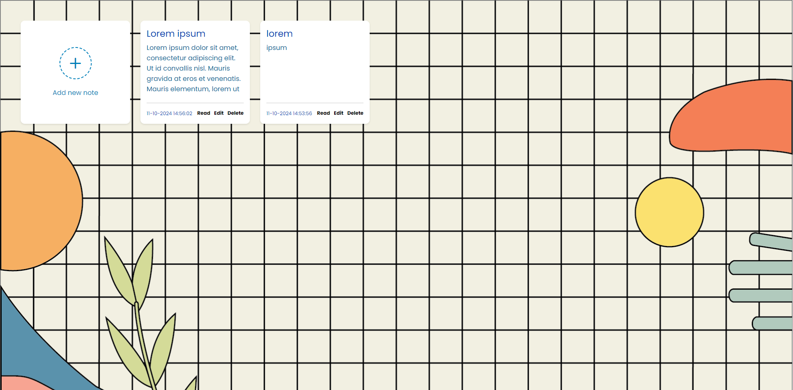

# Aplikasi Catatan Sederhana



Aplikasi web ringan dan responsif untuk membuat, membaca, mengedit, dan mengelola catatan. Dibuat dengan PHP dan SQLite untuk penggunaan dan penerapan yang mudah.

## Fitur

- Buat catatan baru dengan judul dan deskripsi
- Baca catatan dalam jendela popup
- Edit catatan yang sudah ada
- Hapus catatan
- Desain responsif untuk ponsel dan desktop
- Penanda waktu untuk setiap catatan
- Tidak memerlukan database eksternal (menggunakan SQLite)

## Persyaratan

- PHP 7.0 atau lebih tinggi
- Ekstensi PHP SQLite3

## Instalasi

1. Clone repository:
```
git clone https://github.com/usernamekamu/aplikasi-catatan.git
```

2. Pindahkan file ke direktori server web Anda

3. Pastikan direktori memiliki izin tulis untuk database SQLite:
```
chmod 755 /path/ke/aplikasi-catatan
```

4. Akses aplikasi melalui browser web:
```
http://localhost/aplikasi-catatan
```

## Struktur File

```
aplikasi-catatan/
│
├── index.php        # File aplikasi utama
├── function.php     # Penangan database dan fungsi
├── style.css        # File stylesheet
├── background.png   # Gambar latar belakang
├── note.sqlite      # Database SQLite (dibuat otomatis)
└── README.md        # File ini
```

## Cara Penggunaan

- Klik "Add new note" untuk membuat catatan
- Gunakan "Read" untuk melihat konten lengkap catatan
- Gunakan "Edit" untuk mengubah catatan yang ada
- Gunakan "Delete" untuk menghapus catatan

## Kontribusi

Silakan fork proyek ini dan kirimkan pull request. Anda juga dapat membuka issues untuk bug atau permintaan fitur.

## Ucapan Terima Kasih

- Ikon oleh [Iconscout](https://iconscout.com/)
- Font oleh [Google Fonts](https://fonts.google.com/)

## Fitur yang Akan Datang
Insya Allah Kalau saya ingat hehe.
- [ ] Fitur pencarian catatan
- [ ] Kategori untuk catatan
- [ ] Ekspor catatan ke PDF

Dibuat dengan ❤️ oleh mas pai MEWING🤫🧏‍♂️